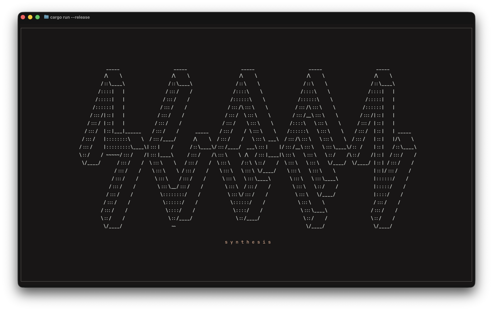

 

  <h3 align="center">mugen</h3>
  

      A terminal-based synth in Rust.  

    

 

## About

This is a passion project to learn more about how synthesizers used in music composition and production work (mathematically) as well as dive into real-time systems in Rust. Synthesisers do a lot of compute and require that there is no noticeble latency from when keys are pressed or released to when the sound is played or stops. Therefore I am finding this quite a nice challenge!

You can play it live from your computer keyboard, switch waveforms as you go, mess with effects and layer notes like a real instrument. You can also create new wave sources and effects and mix them up easily.

Right now it focuses on:

- real-time sound generation
- polyphonic playing
- switching sound character while notes are held
- adsr manipulation (hardcoded to amp)
- dynamic LFO manipulation supporting any kind of wave and any kind of application (amp for now)
- LPF manipulation (low pass filter), still no UI support
- displaying in real time which keys are being played

## Available waveforms

- **Sine**
- **Saw**
- **Square**
- **Triangle**
- **Noise**

You can rotate between them while playing.

## How to play

- Use the keyboard (A–L row + W/E/T/Y/U/O/P) like a small piano
- Hold multiple keys to play chords
- Use **TAB** and arrow buttons to navigate and play around with values
- Press **Q** or **Ctrl+C** to quit

## Architecture

- **Generator** → produces sound (sine, saw, etc.)
- **Node** → changes sound (filters, effects, modulation)
- **PatchSource** → generator + chain of nodes
- The synth just plays the current patch for each key you press

## Screenshot

