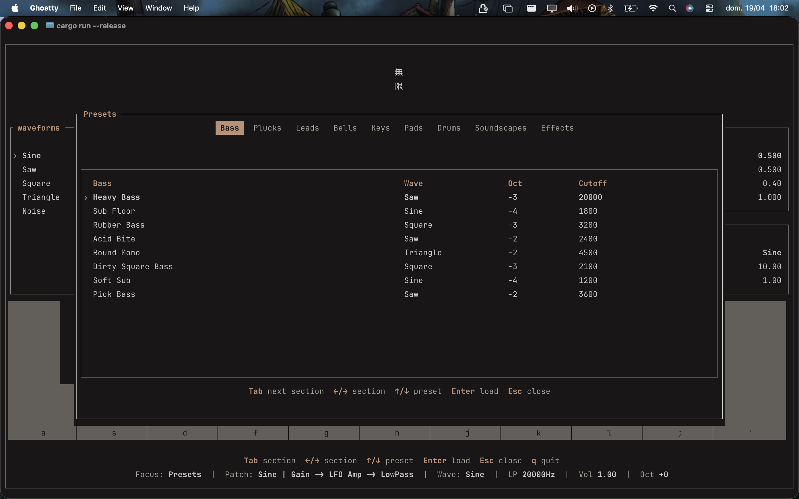

 

  <h3 align="center">mugen</h3>
  

      A terminal-based synth in Rust.
  

    

## About

This is a passion project to learn more about how synthesizers used in music composition and production work (mathematically) as well as dive into real-time systems in Rust.

You can play it live from your computer keyboard, switch presets as you go and mess with effects. You can also create new wave sources and effects and mix them up easily.

Right now it supports:

- real-time sound generation
- polyphonic playing
- switching sound character while notes are playing
- dynamic patch architecture with interchangeable generators and modules
- ADSR manipulation applied per note
- dynamic LFO manipulation supporting any kind of wave and any kind of application (amp for now)
- lowpass filtering with live parameter updates
- loading and switching presets
- terminal UI controlling the engine in real time

The current architecture keeps the patch modular while allowing the audio chain to be constructed only when a note is played, so parameters can be updated live without rebuilding the whole sound, mimmicking what can be achieved through knobs in physical synthesizers.

## Stack

- Rust
- rodio
- ratatui
- crossterm
- tokio
- sqlite

## Latest Feature

The synth now supports presets. You can easily mess around with them through the presets browser (press 'space'). They are organized by category and are loaded from a local sqlite database.

    

