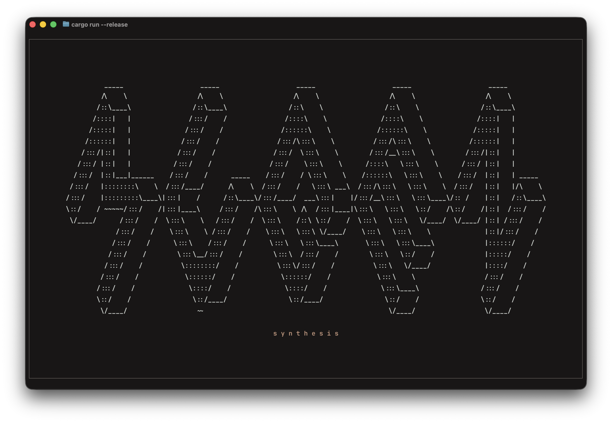
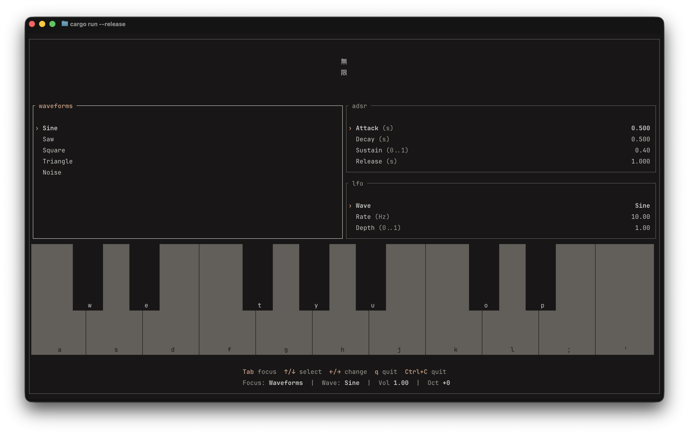

# Mugen

I am building a **terminal-based synthesizer** in Rust.

You can play it live from your computer keyboard, switch waveforms as you go, and layer notes like a real instrument. You can also create Wave Sources and Effects easily due to the generator -> chain of nodes architecture.

Right now it focuses on:

- real-time sound generation
- polyphonic playing
- switching sound character while notes are held
- adsr manipulation (hardcoded to amp)
- dynamic lfo manipulation supporting any kind of wave and any kind of application (amp for now)
- displaying in real time which keys are being played

## Available waveforms

- **Sine**
- **Saw**
- **Square**
- **Triangle**
- **Noise**

You can rotate between them while playing.

## How to play

- Use the keyboard (A–L row + W/E/T/Y/U/O/P) like a small piano
- Hold multiple keys to play chords
- Use **TAB** and arrow buttons to navigate and play around with values
- Press **Q** or **Ctrl+C** to quit

## Screenshot

---

## How it works (very simply)

- **Generator** → produces sound (sine, saw, etc.)
- **Node** → changes sound (filters, effects, modulation)
- **PatchSource** → generator + chain of nodes
- The synth just plays the current patch for each key you press

---

## Next steps (planned)

### Short term

- Audio capture and oscilator/audio wave visualization
- Use **Lua** for config / scripting allowing user to have his own presets
- Make patches and fx configurable and dynamically loadable (third-party friendly)
- Add essential fx (phase distortion, cutoff, etc.)

### Synth improvements

- One sink per voice with a **dynamic mixer** (instead of many sinks) ??
- Proper (not hardcoded) **envelope controls**  
  (attack, decay, sustain, release)
- Unison, detune, LFO, glide/portamento
- Mono / poly modes
- Effects (reverb, delay, distortion, flanger, phaser)

### UI

- Ratatui UI with:
    - knobs/sliders for synth parameters
    - support for real keyboard + MIDI input
    - visualizers (waveform, volume, spectrum)

---

## Long-term idea

A **CLI synth you can jam with friends**.

- Logic Pro compatibility
- Encrypted P2P sessions
- Everyone hears what everyone plays (like a band)
- Each player can bind sounds to keys
- Record the whole session to WAV
- Choose a key and only allow to play notes that belong to it

### Architecture idea

- Audio thread (real-time, high priority)
- Network thread (async, P2P)
- Lock-free ring buffers between them
- Low-latency streaming (<50ms target)

Session owner mixes audio and distributes it back to peers.
