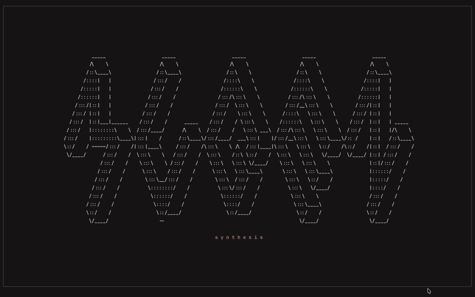

 

  <h3 align="center">mugen</h3>
  

      A terminal-based synth in Rust.
  

    

## About

This is a passion project to learn more about how synthesizers used in music composition and production work (mathematically) as well as dive into real-time systems in Rust. Synthesizers do a lot of compute and require that there is no noticeable latency from when keys are pressed or released to when the sound is played or stops. Therefore I am finding this quite a nice challenge.

You can play it live from your computer keyboard, switch waveforms as you go, mess with effects and layer notes like a real instrument. You can also create new wave sources and effects and mix them up easily.

Right now it focuses on:

- real-time sound generation  
- polyphonic playing  
- switching sound character while notes are held  
- dynamic patch architecture with interchangeable generators and modules  
- ADSR manipulation applied per note  
- dynamic LFO manipulation supporting any kind of wave and any kind of application (amp for now)  
- lowpass filtering with live parameter updates  
- runtime state propagation through snapshots  
- terminal UI controlling the engine in real time  

The current architecture keeps the patch modular while allowing the audio chain to be constructed only when a note is played, so parameters can be updated live without rebuilding the whole synth.

## Why

The goal is not only to make a synth, but to understand how proper modular systems behave internally:

- source generation  
- modulation  
- envelope shaping  
- filtering  
- state propagation  
- live parameter control  

while keeping everything simple enough to extend cleanly.

## Current direction

The project is moving toward a more complete modular synth where modules remain interchangeable and the engine decides how to build the final chain at runtime.

That means:

- generators stay independent  
- modules stay reusable  
- state stays synchronized  
- UI reflects engine truth  

## Stack

- Rust  
- rodio  
- ratatui  
- crossterm  
- tokio  

## Notes

The goal is not to emulate a DAW or a full VST, but to build something closer to a real instrument that happens to live in the terminal.
